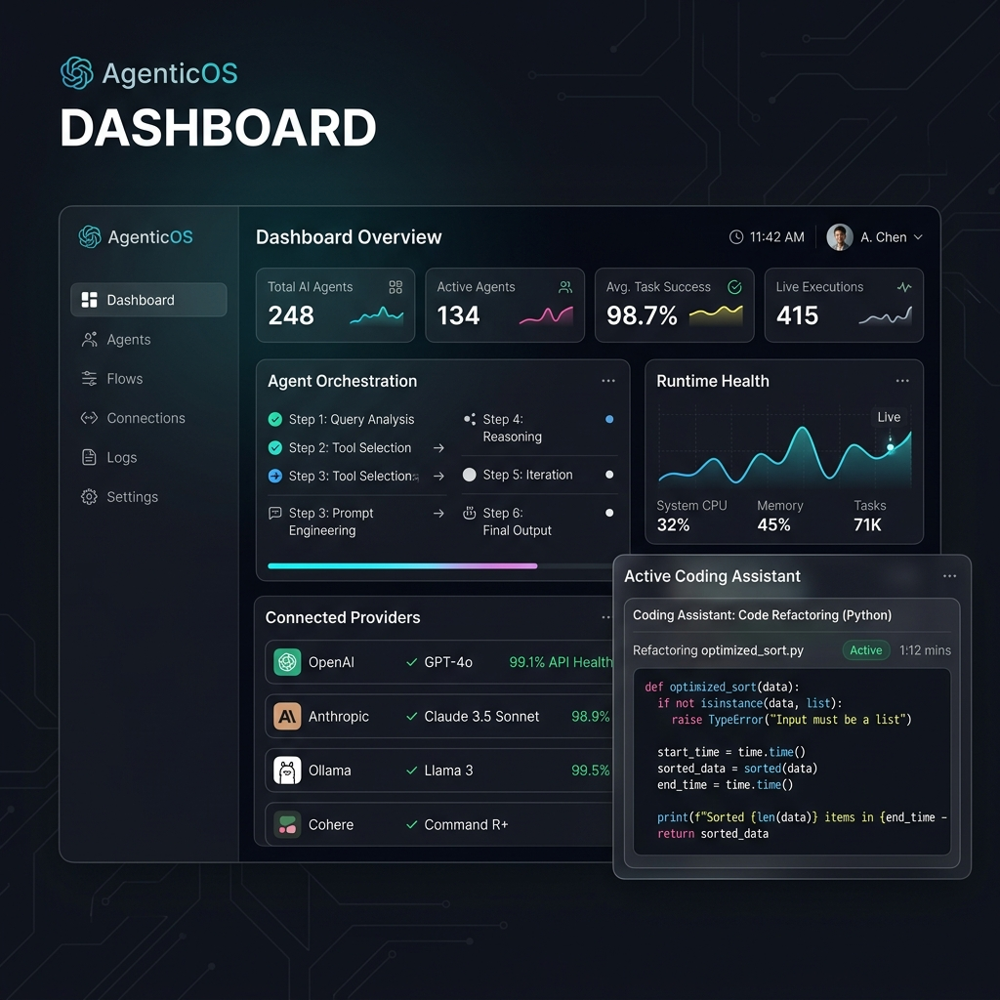
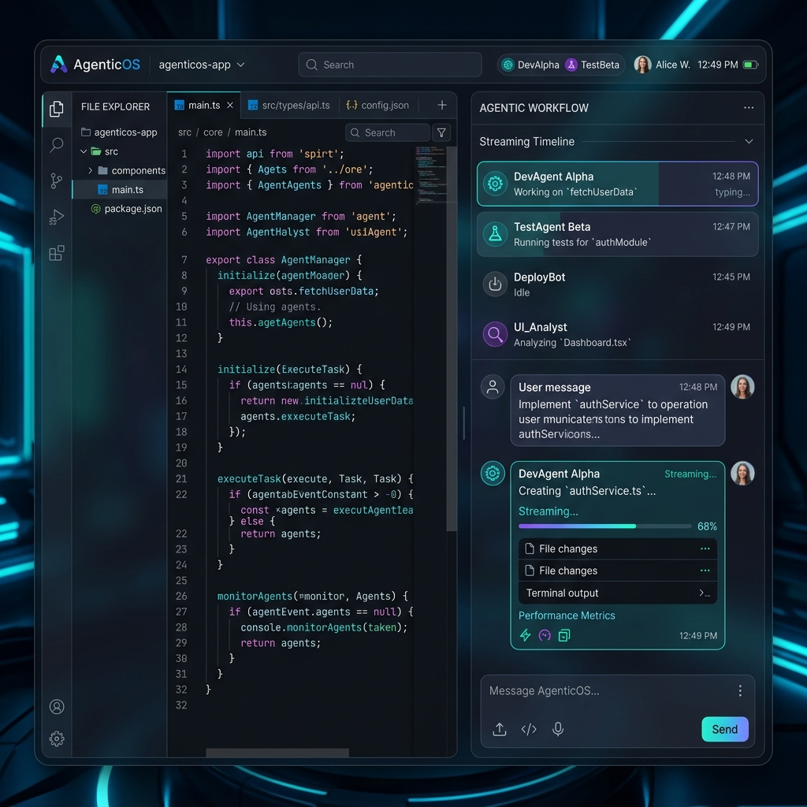

# 🪐 AgenticOS

[](https://github.com/patil-shubham-dev/AgenticOS)
[](https://www.electronjs.org/)
[](https://react.dev/)
[](https://www.typescriptlang.org/)
[](https://tailwindcss.com/)

> An open-source, AI-powered development operating system with a premium desktop interface, multi-agent orchestration, MCP integration, and an extensible tool ecosystem.

AgenticOS is an **Electron-based desktop application** that turns AI models (Claude, GPT-4o, Llama 3, etc.) into a collaborative agent workforce for software development. It features a VS Code-style interactive file explorer, a split-view code canvas, real-time multi-agent execution tracking, and a unified provider gateway.

---

## 📸 Interface Preview

### Unified Mission Control Dashboard


### Integrated Workspace & Code Canvas


---

## ✨ Premium Features

- **📂 Workspace Explorer** — Browse, open, create, rename, and delete files/folders with a VS Code-style tree view.
- **💻 Multi-Panel Code Workspace** — Split-view code editor with Monaco, diff viewer, and file tabs.
- **💬 AI Chat Assistant** — Conversational interface with streaming responses, markdown rendering, and syntax-highlighted code blocks.
- **🤖 Multi-Agent Orchestration** — Autonomous, fastest, most-accurate, research-heavy, human-guided, and safe execution modes.
- **👥 Agent Workforce** — Specialized Manager, Coder, Researcher, Browser, and QA agents that collaborate on tasks.
- **👁️ Real-Time Agent Visibility** — Live state panel showing what each agent is doing step-by-step.
- **⚙️ Extensible Tool System** — Built-in tools: Read, Write, Edit, Glob, Grep, Bash, WebFetch, WebSearch, and more.
- **🔌 MCP Support** — Connect to Model Context Protocol servers (stdio, SSE, WebSocket, HTTP) for expanded tooling.
- **🎯 Provider Gateway** — Connect OpenAI, Anthropic, Ollama, OpenRouter, and any OpenAI-compatible API.
- **🔒 Security Engine** — Path allowlisting, permission engine, threat model with 12 documented threats, and manual approval gate.

---

## 🚀 Getting Started

### Prerequisites

- [Node.js](https://nodejs.org/) >= 18
- npm

### Installation

```bash
# Clone the repository
git clone https://github.com/patil-shubham-dev/AgenticOS.git
cd AgenticOS

# Install dependencies
npm install
```

### Development Mode

```bash
npm run dev
```
Starts the Electron dev server with hot-reload.

### Build and Distribute

```bash
# Compile TypeScript & Build Renderer
npm run build

# Package Production Installer (Windows)
npm run dist:win
```

Production installers will be located in the `release/` folder.

---

## 🛠️ Commands & Scripts

| Script | Description |
|:---|:---|
| `npm run dev` | Run development server with Electron |
| `npm run typecheck` | Run TypeScript compilation check (`tsc --noEmit`) |
| `npm run lint` | Run ESLint check for frontend files |
| `npm run test` | Run Vitest unit tests |
| `npm run test:e2e` | Run end-to-end integration tests |
| `npm run dist` | Build installer for current platform |
| `npm run dist:mac` | Build installer for macOS |
| `npm run dist:linux` | Build installer for Linux |

---

## 🏗️ Architecture

```
AgenticOS/
├── src/
│   ├── main/                # Electron main process (IPC handlers, window mgmt)
│   │   └── ipc/             # IPC handlers (filesystem, git, browser, etc.)
│   ├── preload/             # Electron preload scripts (context bridge)
│   └── renderer/            # React/TypeScript frontend
│       ├── components/      # UI components
│       │   ├── workspace/   # File tree, code editor, chat, timeline, explorer
│       │   ├── settings/    # Provider, role, tool settings
│       │   └── ui/          # Design system primitives
│       ├── core/            # Kernel, kernel services, error boundaries
│       ├── lib/             # Core libraries (workspace, git, file history, etc.)
│       │   └── tauri-shims/ # Tauri API compatibility layer for Electron
│       ├── pages/           # Route pages
│       ├── runtime/         # Execution engine, agent orchestration, streaming
│       │   ├── agents/      # Agent executor, resolver
│       │   ├── execution/   # ExecutionOrchestrator, SessionManager
│       │   ├── mcp/         # MCP client, registry, server management
│       │   ├── memory/      # Hierarchical memory system
│       │   ├── streaming/   # StreamManager (token coalescer)
│       │   ├── tools/       # Tool registry, pipeline, implementations
│       │   └── skills/      # Skill system (custom prompts)
│       ├── stores/          # Zustand state stores
│       └── performance/     # Performance monitoring, leak detection
├── packages/                # Shared packages
│   ├── providers/           # AI provider gateway
│   ├── shared/              # Common types, constants, utilities
│   └── ui/                  # UI component library
├── release/                 # Build artifacts
├── tests/                   # Browser, journey, durability, stress tests
└── resources/               # Icons, branding, installer assets
```

---

## ⚙️ Configuration

### 1. Providers
Connect AI providers in **Settings → Providers**:
- OpenAI (GPT-4o, GPT-4o-mini)
- Anthropic (Claude 3.5 Sonnet, Claude 3 Opus)
- Ollama (local models)
- OpenRouter
- Custom OpenAI-compatible endpoints

### 2. Roles & Models
Assign models to agent roles in **Settings → Roles**:
- **Manager** — Orchestrates and delegates tasks.
- **Coder** — Writes, refactors, and edits code.
- **Researcher** — Searches the workspace files and the web.
- **QA** — Runs tests and verifies correctness.
- **Memory** — Context management and summarization.

---

## 📄 License

This project is licensed under the MIT License.
